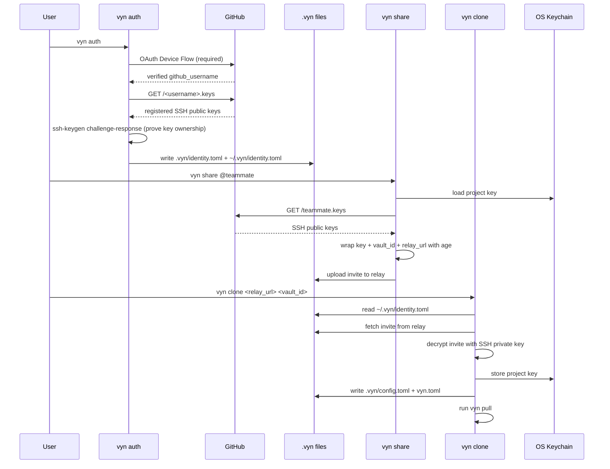
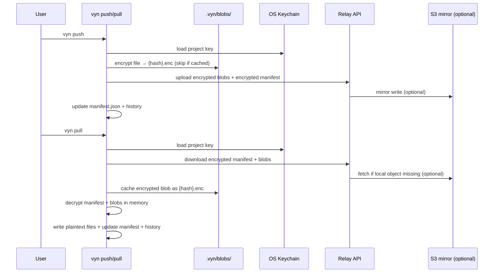

<p align="center">
  
  <br />
  <h1 align="center">vyn</h1>
  <p align="center">Encrypted env/config sync CLI for teams. Helps you encrypt, sync, diff, share, and run environment/config files with a local-first workflow and optional relay/S3 storage.</p>
  <p align="center">
    <a href="https://crates.io/crates/vyn-cli"></a>
    <a href="https://crates.io/crates/vyn-core"></a>
    <a href="https://crates.io/crates/vyn-relay"></a>
    <a href="https://github.com/arnonsang/vyn/actions"></a>
    <a href="LICENSE"></a>
  </p>
</p>

> **This project is under active development.** Until v1.0.0 is released, any version bump may include breaking changes to the CLI interface, config file format, relay protocol, or storage layout. Pin your version if you depend on stable behavior.

## Highlights

- AES-256-GCM encryption for all synced blobs and manifests
- GitHub OAuth Device Flow identity (no passwords, no manual username entry)
- SSH-based project key sharing via age - invite embeds vault ID, relay URL, and key so recipients can onboard in one command
- `vyn.toml` - non-secret public config committed to Git; enables zero-config `vyn pull` and `vyn clone`
- One-step onboarding: `vyn clone` - finds invite, imports key, pulls all files
- Relay inspection: `vyn relay status` and `vyn relay ls`
- Local vault metadata under `.vyn/`
- Diff and status against encrypted baseline
- Self-hosted relay server with optional S3 mirroring
- P2P module available in vyn-core (Soon)

## Table of Contents

- [Project Layout](#project-layout)
- [Install](#install)
  - [Option A: Install from crates.io (recommended)](#option-a-install-from-cratesio-recommended)
  - [Option B: Pre-built binary](#option-b-pre-built-binary)
  - [Option C: Build from source](#option-c-build-from-source)
  - [Uninstall](#uninstall)
- [Quick Start](#quick-start)
- [Configuration](#configuration)
- [Relay Deployment](#relay-deployment)
- [Relay Backend Modes](#relay-backend-modes)
- [Command Reference](#command-reference)
- [How It Works](#how-it-works)
- [Environment Variables](#environment-variables)
- [Security Notes](#security-notes)
- [Current Status](#current-status)

## Project Layout

- `crates/vyn-core`: crypto, keychain, manifest, storage, diff/merge, p2p
- `crates/vyn-cli`: end-user CLI command surface
- `crates/vyn-relay`: gRPC relay service implementation
- `proto/vyn.proto`: relay API contract (canonical source; bundled into `crates/vyn-relay/proto/` for publishing)

## Install

### Option A: Install from crates.io (recommended)

```bash
cargo install vyn-cli
vyn --help
```

### Option B: Pre-built binary

No Rust toolchain required. Auto-detects your OS and architecture.

**Linux / macOS**

```bash
curl -fsSL https://github.com/arnonsang/vyn/releases/latest/download/install.sh | sh
```

or with wget:

```bash
wget -qO- https://github.com/arnonsang/vyn/releases/latest/download/install.sh | sh
```

**Windows**

Download `vyn-x86_64-pc-windows-msvc.zip` from [releases](https://github.com/arnonsang/vyn/releases/latest), extract, and add `vyn.exe` to a directory in your `PATH`.

### Option C: Build from source

**With Rust toolchain**

```bash
git clone https://github.com/arnonsang/vyn.git
cd vyn
cargo install --path crates/vyn-cli
vyn --help
```

**Via Docker**

Compiles from source inside Docker and copies the binary to your host.

```bash
git clone https://github.com/arnonsang/vyn.git
cd vyn
docker build -f Dockerfile.cli -t vyn-cli-builder .
docker run --rm -v "$HOME/.local/bin:/output" vyn-cli-builder
```

Make sure `~/.local/bin` is in your `PATH`, then verify:

```bash
vyn --help
```

To update, re-pull and rebuild:

```bash
git -C vyn pull
docker build -f Dockerfile.cli -t vyn-cli-builder .
docker run --rm -v "$HOME/.local/bin:/output" vyn-cli-builder
```

### Uninstall

Detects how `vyn` was installed and removes the binary and global config.

```bash
curl -fsSL https://github.com/arnonsang/vyn/releases/latest/download/uninstall.sh | sh
```

or with wget:

```bash
wget -qO- https://github.com/arnonsang/vyn/releases/latest/download/uninstall.sh | sh
```

## Quick Start

```bash
# 1. Initialize a vault (creates .vyn/ and a public vyn.toml then commit it!)
vyn init my-project

# 2. Configure storage (do this before auth if using relay, auth registers your identity on the relay)
vyn config

# 3. Authenticate: GitHub OAuth Device Flow + SSH key verification
#    Writes .vyn/identity.toml AND ~/.vyn/identity.toml (global, used by vyn clone).
vyn auth

# 4. Push encrypted state
vyn push

# 5. Pull and restore
vyn pull
```

### Joining an existing vault (one step)

```bash
mkdir my-project && cd my-project
vyn clone https://relay.example.com <vault_id>
# Reads ~/.vyn/identity.toml, fetches invite, stores key, pulls all files.
```

## Configuration

`vyn.toml` (committed to Git) - public vault config:

```toml
# vyn.toml (this file is committed to Git and contains non-secret config)
vault_id = "<uuid>"
relay_url = "https://relay.example.com"
```

Primary private config file: `.vyn/config.toml` (not committed):

```toml
vault_id = "<uuid>"
project_name = "my-project"
storage_provider = "relay"        # memory | relay | unconfigured
relay_url = "https://relay.example.com"
```

Identity file written by `vyn auth`:

```toml
# .vyn/identity.toml
github_username = "your-handle"
ssh_private_key = "/home/you/.ssh/id_ed25519"
ssh_public_key  = "/home/you/.ssh/id_ed25519.pub"
```

### Configure via CLI Wizard

```bash
# Interactive mode
vyn config

# Non-interactive (CI/script)
vyn config --provider memory --non-interactive

vyn config \
  --provider relay \
  --relay-url https://relay.example.com \
  --non-interactive
```

If `--provider relay` is used with `--non-interactive`, `--relay-url` is required.

## Relay Deployment

Files included: `Dockerfile`, `docker-compose.yml`

### 1. Run relay directly

```bash
vyn serve --relay --port 50051 --data-dir ./.vyn-relay
```

With optional S3 mirroring:

```bash
vyn serve --relay \
  --port 50051 \
  --data-dir ./.vyn-relay \
  --s3-bucket my-vyn-bucket \
  --s3-region us-east-1 \
  --s3-endpoint https://s3.us-east-1.amazonaws.com \
  --s3-prefix vyn
```

### 2. Run via Docker

```bash
docker run --rm -p 50051:50051 -v vyn-relay-data:/data ghcr.io/arnonsang/vyn-relay:latest \
  --relay --port 50051 --data-dir /data
```

Using environment variables:

```bash
docker run --rm -p 50051:50051 -v vyn-relay-data:/data \
  -e VYN_RELAY_PORT=50051 \
  -e VYN_RELAY_DATA_DIR=/data \
  -e VYN_RELAY_S3_BUCKET=my-vyn-bucket \
  -e VYN_RELAY_S3_REGION=us-east-1 \
  ghcr.io/arnonsang/vyn-relay:latest --relay
```

### 3. Run via Docker Compose

```bash
VYN_RELAY_PORT=50052 docker compose up -d --build
```

Relay data is stored in the named volume `vyn-relay-data`.

### Relay environment variables

| Variable | Default | Description |
|---|---|---|
| `VYN_RELAY_PORT` | 50051 | Listening port |
| `VYN_RELAY_DATA_DIR` | `./.vyn-relay` | Local persistence directory |
| `VYN_RELAY_S3_BUCKET` | *(none)* | S3 mirror bucket (optional) |
| `VYN_RELAY_S3_REGION` | *(none)* | S3 region (required if bucket set) |
| `VYN_RELAY_S3_ENDPOINT` | *(none)* | Custom S3 endpoint (optional) |
| `VYN_RELAY_S3_PREFIX` | *(none)* | Key prefix inside bucket (optional) |

CLI args override environment variables; environment variables override defaults.

### TLS for the Relay

The relay server does not terminate TLS itself. To encrypt traffic in transit:

**Option A: Reverse proxy (recommended)**

Put nginx, caddy, or a load balancer in front and forward to the relay's plain gRPC port:

```nginx
# nginx example
server {
    listen 443 ssl http2;
    ssl_certificate     /etc/ssl/certs/relay.crt;
    ssl_certificate_key /etc/ssl/private/relay.key;

    location / {
        grpc_pass grpc://127.0.0.1:50051;
    }
}
```

Set `relay_url = "https://relay.example.com"` in `.vyn/config.toml`.

**Option B: Tonic built-in TLS** *(coming soon)*

Support for native TLS termination inside the relay process is on the roadmap. In the meantime, if you'd prefer not to use a reverse proxy, you're welcome to clone the repo and add `.tls_config(ServerTlsConfig::new().identity(Identity::from_pem(cert, key)))` to the `Server::builder()` in `crates/vyn-relay/src/lib.rs`. The [tonic docs](https://docs.rs/tonic/latest/tonic/transport/struct.ServerTlsConfig.html) have more details.

## Relay Backend Modes

| Mode | How to enable | Write | Read | Best fit |
|---|---|---|---|---|
| local-only | `vyn serve --relay --data-dir ...` | Persist to relay volume | Read from relay volume | Simplest self-host |
| local + S3 mirror | add `--s3-bucket` + `--s3-region` | Persist locally first, then mirror to S3 | Local cache; fallback to S3 | Durability + cloud copy |

In both modes clients use `storage_provider = "relay"`. If S3 is unavailable, relay falls back to local persistence automatically.

## Command Reference

### Core Commands

#### vyn init [name]

Initialize a new vault in the current directory. Fails with an error if a vault already exists (`.vyn/config.toml` present).

- Creates `.vyn/` and `.vyn/blobs/`
- Generates a random vault UUID and AES-256-GCM project key
- Stores the project key in the OS keychain
- Writes `.vyn/manifest.json` (initial file index) and `.vyn/config.toml`
- Writes `vyn.toml` in the project root (contains `vault_id` only; non-secret, commit to Git)
- Adds `.vyn/` to `.gitignore` (creates the file if absent)
- Copies `.vynignore.example` to `.vynignore` if an example is present

---

#### vyn auth

Authenticate your local identity using GitHub OAuth and a local SSH key. Runs a guided 3-step flow:

1. **GitHub OAuth Device Flow:** opens `https://github.com/login/device` in your browser. Confirm the one-time code shown in the terminal. No username entry required; GitHub verifies who you are.

2. **SSH key detection:** automatically finds `~/.ssh/id_ed25519` or `~/.ssh/id_rsa`.

3. **Key verification:** fetches your registered keys from `github.com/<you>.keys` and runs a local `ssh-keygen` challenge-response to prove you hold the matching private key. Your local key must be listed on GitHub because teammates use it to encrypt vault invites for you.

   If your key is not on GitHub yet, `vyn auth` prints the key and tells you exactly where to add it.

Writes `.vyn/identity.toml` (local) and `~/.vyn/identity.toml` (global). The global copy lets `vyn clone` work from any empty directory without running auth again.

---

#### vyn clone \<relay_url\> \<vault_id\>

Clone a vault from a relay onto this machine in one step. The most convenient way to join an existing vault.

- Reads `~/.vyn/identity.toml` (global identity set by any previous `vyn auth`)
- Authenticates with the relay using your SSH key
- Fetches and decrypts the invite for your GitHub username
- Stores the vault project key in the OS keychain
- Writes `.vyn/config.toml` and `vyn.toml` with correct relay URL and vault ID
- Runs `vyn pull` automatically to download all files

Requires a teammate to have run `vyn share @you` first.

---

#### vyn config [options]

Configure storage and relay settings in `.vyn/config.toml`. Defaults to an interactive wizard.

Options:
- `--provider <memory|relay>`
- `--relay-url <url>` (required when provider is `relay`)
- `--non-interactive`

---

#### vyn push

Encrypt local tracked files and upload to the configured storage provider.

- Reads `.vyn/config.toml` for vault ID and storage provider
- Loads the project key from the OS keychain
- For each tracked file: encrypts to `.vyn/blobs/{hash}.enc` (skips re-encryption if already cached), then uploads the ciphertext blob
- Encrypts the manifest with the project key and uploads it
- Supports `memory` and `relay` providers
- Writes a local history entry

---

#### vyn pull

Download encrypted state from the storage provider and restore files locally.

- Loads the project key from the OS keychain
- Downloads the encrypted manifest and decrypts it
- For each blob: downloads encrypted ciphertext, caches to `.vyn/blobs/{hash}.enc`, decrypts in memory, writes plaintext to disk
- Updates `.vyn/manifest.json` and writes a history entry

---

#### vyn st [-v]

Show changes against the last push baseline.

- `-v` / `--verbose`: include inline unified diffs for text files and size summaries for binary files

---

#### vyn diff [file]

Show a unified diff against the baseline manifest.

- With `file` argument: diff only that path
- Without argument: all changed paths
- Binary files shown as size-change summary
- Returns an error if the specified file is not tracked

---

#### vyn share @user

Create an encrypted invite for a GitHub user so they can join the vault.

- Fetches SSH public keys from `https://github.com/<user>.keys`
- Wraps the project key, vault ID, and relay URL together for each key using `age`
- Uploads the invite ciphertext to the relay

The invite embeds all connection metadata, so the recipient can run `vyn clone` or `vyn link` without needing the vault ID or relay URL separately.

---

#### vyn link \<vault_id\>

Decrypt an invite and import the project key into the keychain.

- Fetches invites from the relay matching `<vault_id>__<your_username>`
- Uses the private key path from `.vyn/identity.toml` to unwrap the invite
- Stores the project key in the OS keychain
- Bootstraps `.vyn/config.toml` and `vyn.toml` from metadata embedded in the invite (relay URL auto-populated)

---

#### vyn serve --relay [options]

Run the relay server process.

Options:
- `--relay`: required
- `--port`: default 50051
- `--data-dir`: default `./.vyn-relay`
- `--s3-bucket`, `--s3-region`, `--s3-endpoint`, `--s3-prefix`: optional S3 mirror

See environment variable table in [Relay Deployment](#relay-deployment).

---

#### vyn relay status / vyn relay ls

Relay inspection commands. Require an authenticated vault (run `vyn auth` + `vyn config` first).

- `vyn relay status` - check connectivity, show identity, verify auth against the configured relay
- `vyn relay ls` - list all vault IDs on the relay
- `vyn relay ls <vault_id>` - list blob hashes and sizes inside a specific vault

---

### Utility Commands

#### vyn run \<cmd...\>

Run a subprocess with env vars injected from `.env` files and encrypted vault blobs.

- Merges keys from `.env` and `.env.*` files in the current directory
- Decrypts and merges `.env` blobs from the vault baseline (when a project key is available)
- Passes the merged map to the child process environment
- Does not write decrypted values to disk

---

#### vyn check

Compare key sets between `.env` and `.env.example`.

- Reports keys missing from `.env` (present in `.env.example`)
- Reports extra keys in `.env` (not in `.env.example`)
- Exits non-zero on any mismatch

---

#### vyn history

List recorded sync snapshots from `.vyn/history`.

---

#### vyn doctor

Run local health checks. Checks (in order):

| Check | Passes when |
|---|---|
| `vault_directory` | `.vyn/` exists |
| `config_file` | `config.toml` is readable and valid TOML |
| `keychain` | project key loads successfully from the OS keychain |
| `manifest` | `.vyn/manifest.json` is readable and valid |
| `identity` | `.vyn/identity.toml` is valid and both SSH key files exist on disk |
| `relay_config` | `relay_url` is set and starts with `http://` or `https://` |
| `storage` | storage provider is `memory` or `relay` (not `unconfigured`); relay requires `relay_url` |

---

#### vyn rotate

Rotate the project key and re-encrypt all remote state.

- Generates a new AES-256-GCM project key
- Re-encrypts and re-uploads all tracked blobs and the manifest
- Updates the OS keychain with the new key
- Rebuilds invite files for known teammates
- Writes a history entry

---

#### vyn update

Check for a newer version of `vyn` and print upgrade instructions.

- Compares local version against the latest GitHub release tag
- Detects install method (pre-built binary, `cargo install`, Docker) and prints the correct update command
- `--check`: only check and report whether an update is available, without printing instructions

## How It Works

### Auth + Share + Clone Flow



### Push/Pull with Relay Storage



## Environment Variables

| Variable | Used by | Description |
|---|---|---|
| `VYN_GITHUB_CLIENT_ID` | `vyn auth` | Override the built-in OAuth `client_id` (advanced) |
| `VYN_SKIP_GITHUB_VERIFY=1` | `vyn auth` | Skip GitHub identity + SSH verification (offline CI) |
| `VYN_RELAY_PORT` | `vyn serve`, Docker Compose | Relay listening port override |

## Security Notes

- All blobs and manifests are encrypted with AES-256-GCM before leaving the local machine
- Project keys are stored in the OS keychain (Linux keyutils, macOS Keychain, Windows DPAPI)
- Invite files are encrypted specifically for the recipient's SSH public key via `age`
- The relay and S3 backend never see plaintext content or metadata
- `.vyn/` should be excluded from Git; `vyn init` adds it to `.gitignore` automatically
- `VYN_SKIP_GITHUB_VERIFY=1` disables SSH key verification; only active in debug builds

## Current Status

Full MVP command set is implemented and tested:

- Local vault lifecycle: `init`, `st`, `diff`, `config`, `doctor`
- Sync: `push`, `pull`, `history`
- Identity + sharing: `auth` (OAuth + SSH verify), `share`, `link`, `clone`
- Key rotation: `rotate` (re-encrypts all remote state with a new project key)
- **v0.1.3:** `clone` (one-step onboarding), `relay status`, `relay ls`, `vyn.toml` public config, `update` (version check + upgrade instructions)
- Env management: `run`, `check`
- Relay server: `serve` with local and S3-mirror backends
- Docker / Docker Compose deployment ready

The P2P module (`vyn-core::p2p`) is compiled into the library but not yet exposed via CLI commands.

### Planned Improvements

#### Security / Privacy
- [ ] `vyn revoke @user` - remove a teammate's invite from the relay and optionally trigger key rotation; currently there is no way to un-share
- [ ] Invite expiry - time-bound invites (`--expires 7d`) so stale entries on the relay don't accumulate
- [ ] Relay audit log - record who authenticated and which operations ran (no plaintext logged)
- [ ] Passphrase-protected vault - derive PK via Argon2 as an alternative to the OS keychain, so backups work without keychain access

#### Onboarding / Team UX
- [ ] `vyn whoami` - print current identity: github username, SSH key path, relay URL, vault ID
- [ ] `vyn team` - list who has been granted access (reads invite list from relay)
- [ ] `vyn invite` link - generate a short token URL a teammate can paste for one-click `vyn clone` (no out-of-band vault_id sharing)

#### Storage / Transport
- [ ] P2P mode - complete the `libp2p` stub with mDNS discovery + Gossipsub for zero-latency LAN sync
- [ ] `vyn conflicts` - list and interactively resolve conflict-marker files left by `vyn pull`
- [ ] Selective push/pull - `vyn push .env.production` / `vyn pull .env.staging` for single-file sync

#### CI / Automation
- [ ] `vyn env print` - dump decrypted key=value to stdout for CI env injection without subprocess exec
- [ ] Non-interactive auth - `vyn auth --token <github_pat>` for headless CI environments
- [ ] GitHub Actions action - `uses: arnonsang/vyn-action@v1` wrapping install + auth + pull

#### Developer Experience
- [ ] Shell completions - `vyn completions bash|zsh|fish` (clap can generate these)
- [ ] `vyn config --edit` - open `.vyn/config.toml` in `$EDITOR` directly
- [ ] Progress bars on push/pull - show bytes transferred for large blob sets (`indicatif` crate)
- [ ] `vyn add` interactive prompt - show which files will be tracked vs. ignored before writing `.vynignore`


