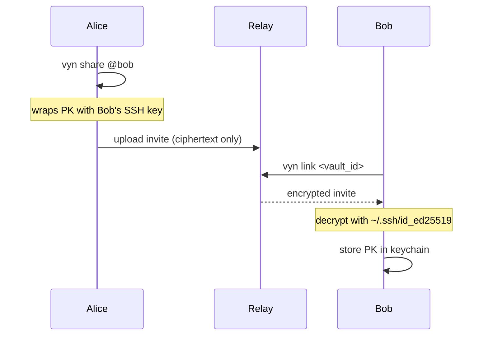

# vyn share / link

## vyn share

Create encrypted invite files for a GitHub user so they can join the vault.

```bash
vyn share @user
```

| Argument | Description |
|---|---|
| `@user` | GitHub username of the recipient (with or without `@`) |

**What it does:**

1. Fetches SSH public keys from `https://github.com/<user>.keys`
2. Loads the project key from the OS keychain
3. Wraps the project key for each SSH key found using `age`
4. Writes invite files to `.vyn/invites/<vault_id>__<user>__<index>.age`

The invite files are encrypted specifically for the recipient's SSH private key. The relay (if used) cannot read the project key.

**Example:**

```bash
vyn share @teammate
# ✓ Created 2 invite(s) for @teammate
#   .vyn/invites/f47ac10b__teammate__0.age
#   .vyn/invites/f47ac10b__teammate__1.age
```

---

## vyn link

Decrypt an invite and import the project key into the keychain.

```bash
vyn link <vault_id>
```

| Argument | Description |
|---|---|
| `vault_id` | UUID of the vault to link |

**What it does:**

1. Reads invite files from `.vyn/invites/` matching `<vault_id>__<your_username>__*.age`
2. Tries each invite with the private key from `.vyn/identity.toml`
3. Stores the decrypted project key in the OS keychain
4. Rewrites `vault_id` in `.vyn/config.toml` to the linked vault's ID

After linking, `vyn push` and `vyn pull` will use the linked vault ID.

## Team onboarding flow


