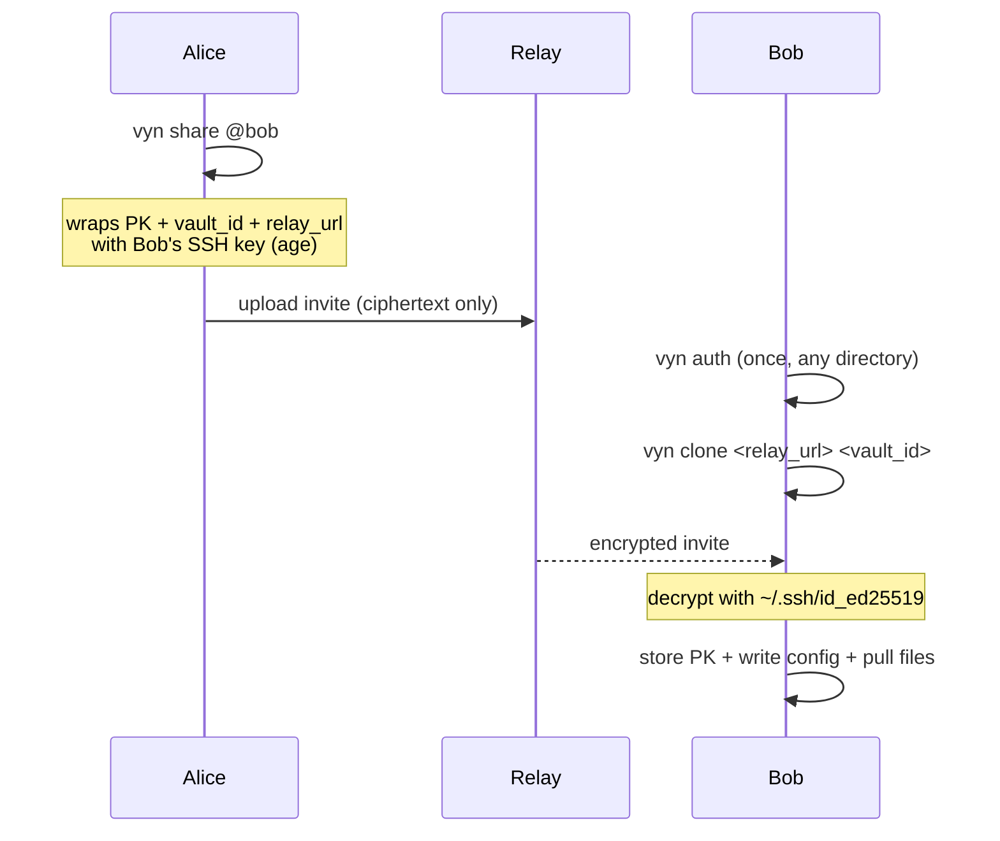

# vyn share / link

## vyn share

Create encrypted invite files for a GitHub user so they can join the vault.

```bash
vyn share @user
```

| Argument | Description |
|---|---|
| `@user` | GitHub username of the recipient (with or without `@`) |

**What it does:**

1. Fetches SSH public keys from `https://github.com/<user>.keys`
2. Loads the project key from the OS keychain
3. Wraps the project key, vault ID, and relay URL together into a JSON payload and encrypts it for each SSH key found using `age`
4. Uploads the invite ciphertext to the relay under the recipient's username

The invite now embeds the full connection details (`vault_id`, `relay_url`, and the project key). The recipient can run `vyn clone` or `vyn link` without needing the vault ID separately.

**Example:**

```bash
vyn share @teammate
# ✓ invite sent to @teammate
#   vault id    f47ac10b-58cc-4372-a567-0e02b2c3d479
#   next step   @teammate can now run: vyn link f47ac10b-58cc-4372-a567-0e02b2c3d479
```

---

## vyn link

Decrypt an invite and import the project key into the keychain.

```bash
vyn link <vault_id>
```

| Argument | Description |
|---|---|
| `vault_id` | UUID of the vault to link |

**What it does:**

1. Fetches invite files from the relay matching `<vault_id>__<your_username>__*.age`
2. Tries each invite with the private key from `.vyn/identity.toml`
3. Stores the decrypted project key in the OS keychain
4. Bootstraps `.vyn/config.toml` and `vyn.toml` from the metadata embedded in the invite (relay URL and vault ID are auto-populated — no manual config needed)

After linking, `vyn push` and `vyn pull` will use the linked vault and relay automatically.

> **Tip:** For a fully automated one-step join, use [`vyn clone`](./clone.md) instead.

## Team onboarding flow


