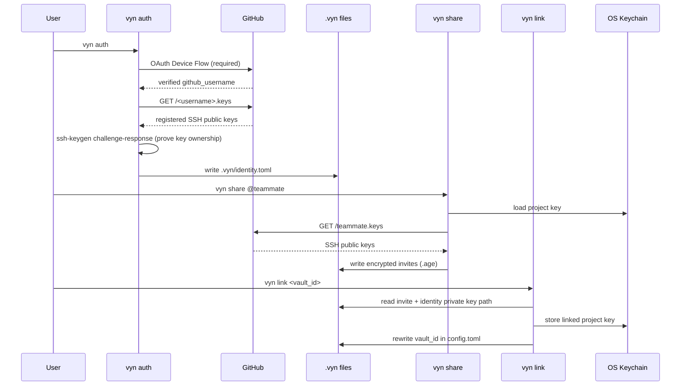
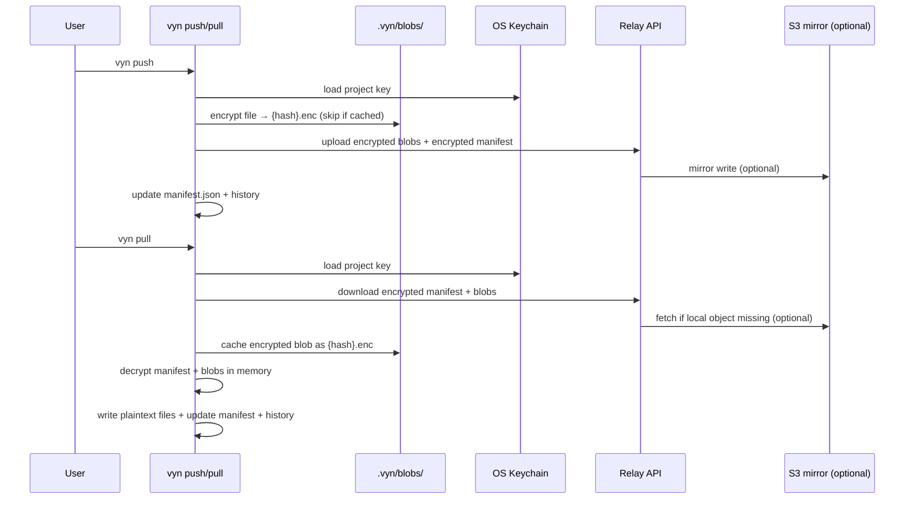

# How Vyn Works

vyn uses two main flows: **identity + sharing**, and **push/pull sync**.

## Auth, Share, and Link

## Push/Pull with Relay Storage

## Key properties

- **Zero-knowledge relay** — the relay and S3 backend never see plaintext content or metadata
- **Content-addressed blobs** — files are stored as `{sha256}.enc`; identical content is deduplicated
- **Idempotent push** — blobs already cached locally are not re-encrypted or re-uploaded
- **In-memory decryption** — `vyn pull` never writes plaintext anywhere except the final destination path
