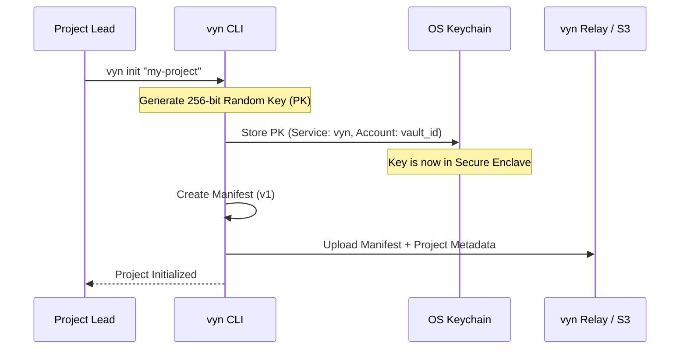
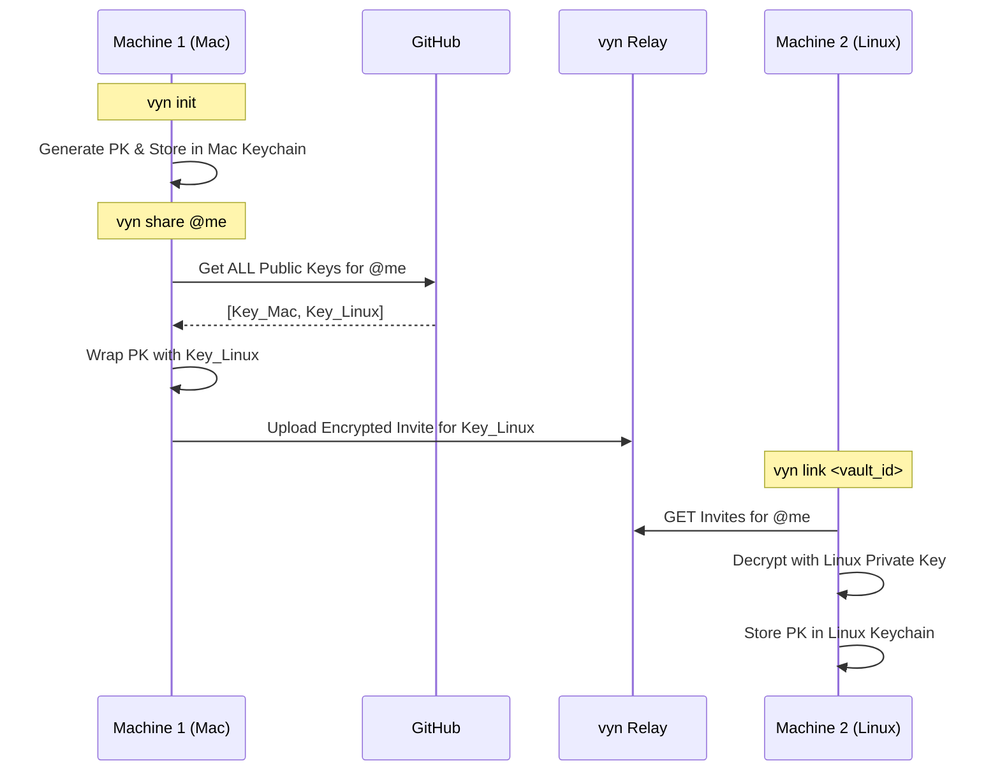

# Key Architecture

vyn uses a two-layer key model.

## Layer 1: Project Key (symmetric)

The Project Key (PK) is a 256-bit AES key generated with `ring::rand::SecureRandom` when you run `vyn init`. It:

- **Never leaves the machine in plaintext** — it is stored only in the OS keychain
- Is used to encrypt every file blob and the manifest before any network transfer
- Is identified in the keychain by `(service=vyn, account=<vault_id>)`

**Key property:** The relay never sees the PK. It only knows that a project with a given `vault_id` exists.

## Layer 2: SSH key wrapping (asymmetric)

To share the vault, the PK is wrapped (encrypted) with the recipient's SSH public key using [age](https://age-encryption.org). The wrapped invite is a `.age` file that can only be decrypted by the holder of the matching SSH private key.

Supported SSH key types: **RSA** and **Ed25519**.

## Multi-device sync

