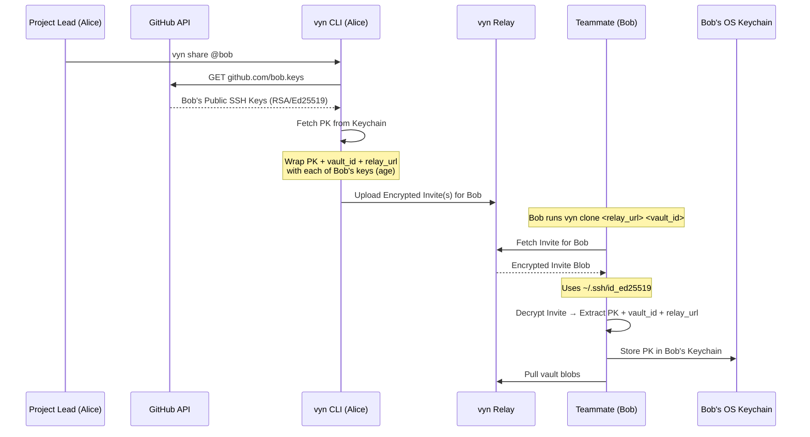

# Sharing Keys

Key sharing uses **asymmetric key wrapping**: the sender encrypts the project key (PK) along with vault metadata using the recipient's public SSH key. Only the recipient's SSH private key can unwrap it.

Each invite embeds three pieces of information:

| Field | Purpose |
|-------|---------|
| Project Key (PK) | The AES-256-GCM key that encrypts all vault blobs |
| `vault_id` | Identifies which vault on the relay to pull from |
| `relay_url` | The relay endpoint Bob's client should connect to |

This means Bob only needs `vyn clone <relay_url> <vault_id>` — no separate `vyn link` step is required.

## Flow: vyn share @bob



## Why this is secure

1. **No shared passwords** — you never transmit the PK in plaintext
2. **Identity-bound** — only the holder of the SSH private key can unlock the invite
3. **Relay-blind** — the relay stores only ciphertext and cannot read the PK
4. **Per-key invites** — if Bob has multiple SSH keys on GitHub, one invite is created for each key so any of his machines can clone
5. **Self-contained** — the invite carries everything Bob needs; no out-of-band vault ID sharing required

## Commands

```bash
# Share with a teammate
vyn share @bob

# Share with yourself (for multi-device setup)
vyn share @me

# Accept an invite and set up a local vault copy
vyn clone <relay_url> <vault_id>
```

> **Note:** `vyn link <vault_id>` is also available to accept an invite into an *existing* local vault directory rather than cloning a fresh copy.

See [vyn share / link](../cli/share-link.md) for full CLI reference.
