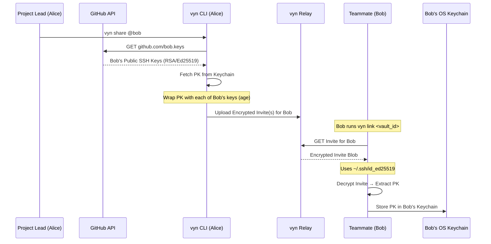

# Sharing Keys

Key sharing uses **asymmetric key wrapping**: the sender encrypts the PK with the recipient's public SSH key. Only the recipient's private key can unwrap it.

## Flow: vyn share @bob



## Why this is secure

1. **No shared passwords** — you never transmit the PK in plaintext
2. **Identity-bound** — only the holder of the SSH private key can unlock the invite
3. **Relay-blind** — the relay stores only ciphertext and cannot read the PK
4. **Per-key invites** — if Bob has multiple SSH keys on GitHub, one invite is created for each key so any of his machines can link

## Commands

```bash
# Share with a teammate
vyn share @bob

# Share with yourself (for multi-device setup)
vyn share @me

# Accept an invite
vyn link <vault_id>
```

See [vyn share / link](../cli/share-link.md) for full CLI reference.
